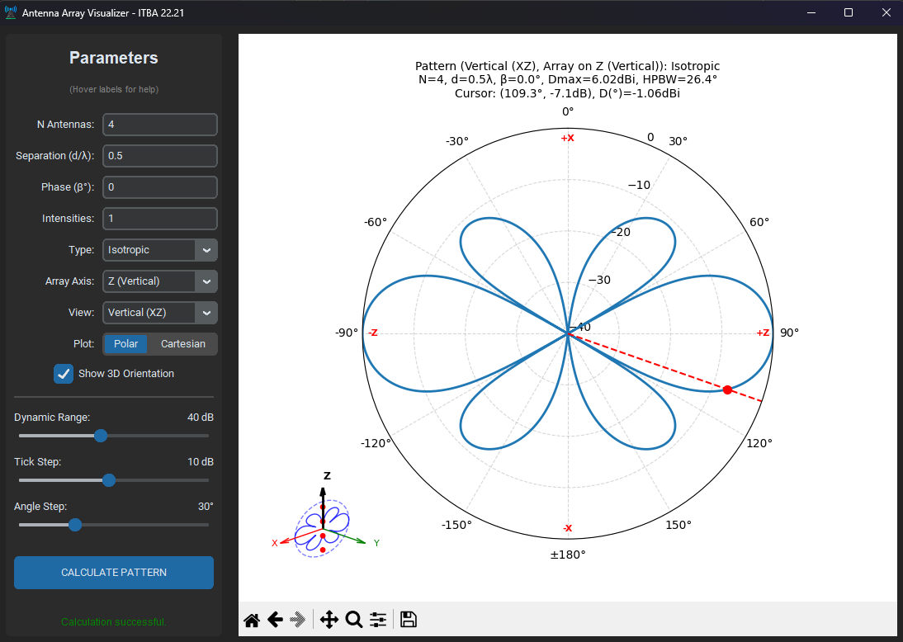

# Antenna Array Visualizer

A simple desktop application to calculate and visualize the radiation pattern of linear antenna arrays. This project was developed for the Electromagnetism course (22.21) at Instituto Tecnológico de Buenos Aires (ITBA).



## Features

*   Calculate and visualize radiation patterns for linear antenna arrays using the Multiplication Theorem.
*   Support for multiple element types: Isotropic, Dipole (λ/2), and Monopole (λ/4).
*   Adjustable parameters:
    *   Number of antennas (N).
    *   Separation between antennas (d/λ).
    *   Progressive phase shift (β in degrees) for beam steering.
    *   Current intensities for each element (supports uniform or custom distributions).
*   Multiple views: Vertical (Elevation/Theta) and Horizontal (Azimuth/Phi) planes.
*   Plot types: Polar (directional) and Cartesian (rectangular) coordinate systems.
*   Customizable plot settings:
    *   Dynamic range (dB floor).
    *   Tick step for grid lines.
    *   Angle step for axis labels.
*   Interactive tooltips for parameter guidance.
*   Navigation toolbar for zooming, panning, and saving plots.

## Building the Installer

To create an installer for the application, follow these steps:

1. Ensure all dependencies are installed:
   ```bash
   pip install -r requirements.txt
   ```
2. Install PyInstaller (if not already installed):
   ```bash
   pip install pyinstaller
   ```
3. Build the executable using the provided spec file:
   ```bash
   pyinstaller AntennaArrayVisualizer.spec
   ```
   This generates `AntennaArrayVisualizer.exe` in the `dist` folder.
4. Install Inno Setup (free tool from [jrsoftware.org](https://jrsoftware.org/isinfo.php)).
5. Open `innoSetupScript.iss` in Inno Setup Compiler and compile it to create the installer `Installer_AntennaArrayVisualizer.exe` in the `Output` folder).


## Authors

*   *Alejandro Nahuel Heir*
*   *María de Guadalupe Voss*

## Acknowledgements

Special thanks to the teaching staff of the Electromagnetism course at ITBA for their guidance and support:

*   *Lic. Patricio Alejandro Marco* (Course Director)
*   *Eng. Pablo Luciano Lannes* (Adjunct Professor)

## Bibliography

*   Course material from "Electromagnetism" (22.21) at ITBA.
*   Balanis, Constantine A. *Antenna Theory: Analysis and Design*. 4th ed., John Wiley & Sons, Inc., 2016.

## License

This project is licensed under the MIT License. See the [LICENSE](LICENSE) file for details.